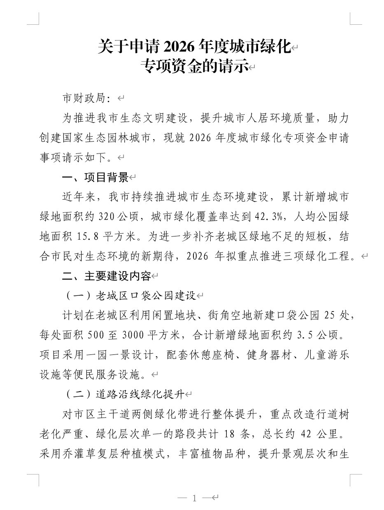
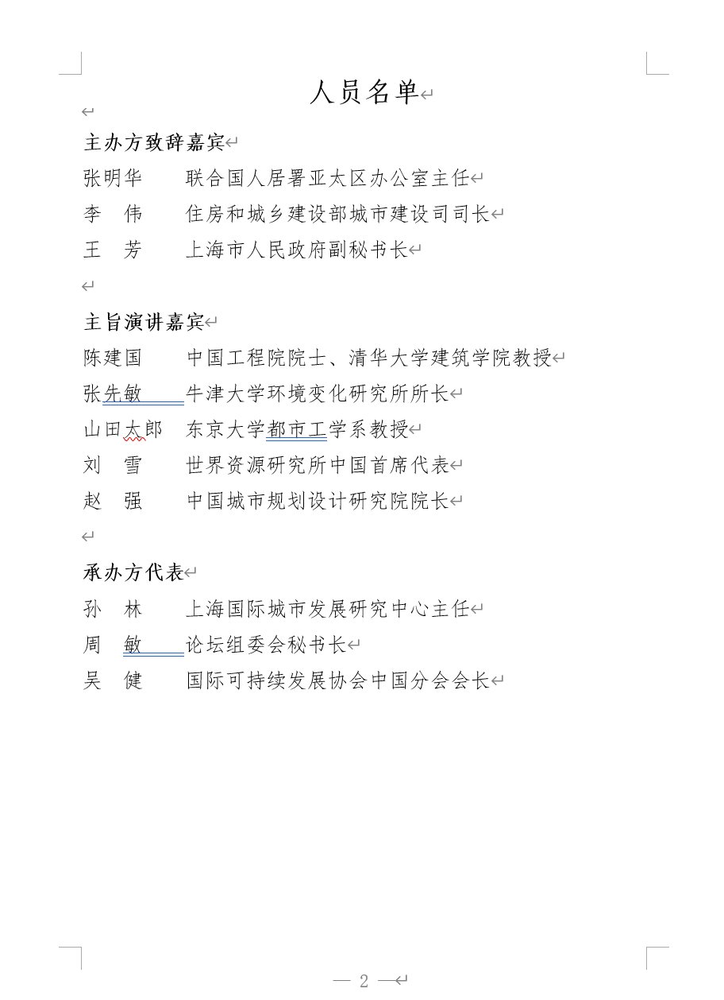

# 中文文档校对与排版 · proofreading-formatter

一个给 Claude 和 OpenClaw 用的 Skill。把一段中文草稿变成可打印的定稿 Word 文件——**先校对文字（错别字、病句、标点、数字规范），再按指定格式排版（字体、字号、行距、页边距全部符合规范）**。

支持三种常用的中文正式文档格式：政府公文报告 / 内部谈参汇报 / 活动议程与名单。

## 三种格式长什么样

下面这三张截图是用 `examples/` 目录下的虚构范例直接生成的。所有内容都是杜撰的公开素材，跟任何真实机构或个人无关。

### 格式 A · 政府公文报告

严格遵循 GB/T 9704《党政机关公文格式》。方正小标宋简体二号居中标题、仿宋_GB2312 三号正文、固定行距 28 磅、首行缩进两字符。适用于请示、报告、通知、函、批复等正式发文。



### 格式 B · 内部谈参 / 情况说明

用于领导参阅的内部材料——接待背景、会前快读、工作汇报、情况说明这类。黑体加粗标题 + 仿宋正文，纯黑配色，关键数据用下划线或加粗标记。可读性优先，信息密度高。


### 格式 C · 活动议程与人员名单

正式活动、座谈会、来访接待的议程材料。封面页大字居中标题 + 时间地点信息 + 议程条目；第二页人员名单按单位分组，姓名两字/三字对齐。

封面页：


人员名单页：



## 怎么用

### 最常见的用法：装到 Claude 里

下载本项目打包好的 `.skill` 文件（从 Releases 页面，或者自己用官方工具打包项目根目录），在 Claude 设置里导入，然后就可以在对话里直接让它干活：

> **你**：帮我校对这份材料，然后按公文格式排版。
> *[贴上或上传中文草稿]*
>
> **Claude**：我用了格式 A（政府公文报告）。校对时发现 3 处问题：
> - "做为" → "作为"（错别字）
> - "规化" → "规划"（错别字）
> - "..." → "……"（省略号规范）
>
> 已生成 `关于申请2026年度城市绿化专项资金的请示 打印版.docx`，请查收。

Claude 会自动判断适合哪种格式；判断不出来会直接问你。输出文件统一按「文档主标题 + 打印版」命名，方便归档。

### OpenClaw 里怎么用

跟 Claude.ai 一样导入 Skill 即可。OpenClaw 的运行环境自带 Node.js 和 `docx` 包，无需额外安装。

### 想自己改内容重新生成怎么办

每个范例目录里都有一个 `content.json` 和对应的 `output.docx`。你可以直接复制一份 JSON，改掉里面的文字，再让 Claude 或 OpenClaw 重新生成——或者自己在命令行跑：

```bash
node scripts/build_docx.js your_content.json your_output.docx a   # 或 b、c
```

前提是本地装了 Node.js 18+ 和 `docx` 包（`npm install -g docx`）。

## 常见问题

**Q：我没有方正小标宋简体这种字体，会不会排版错乱？**

不会。脚本在 Word 里指定的是字体名，如果系统没装会自动退化到同系字体（宋体、华文中宋等）。打印效果略有差别，但结构、间距、缩进都是对的。

**Q：校对结果我不满意，它漏改了/乱改了。**

Skill 本身不做自动修改——它只是告诉 Claude / OpenClaw "该检查这几类问题"。实际校对是模型做的，所以质量取决于模型本身。你可以在对话里直接说"XX 这处不要改"或"帮我再检查一遍数字用法"，模型会重新跑一遍。

**Q：只支持中文吗？**

是。所有格式规范都是按中文正式文档的排版约定设计的。英文或中英混排的内容能跑，但英文部分不会遵循英文排版习惯。

## 项目里有什么

```
proofreading-formatter/
├── SKILL.md                        # 给 Claude / OpenClaw 读的执行说明
├── README.md                       # 你正在看的文件
├── scripts/build_docx.js           # 构建脚本（一个脚本三种格式）
├── references/                     # 格式规范、JSON 结构、校对规则、已知坑
├── examples/                       # 三个完整范例（JSON + docx）
└── docs/previews/                  # 三张样张截图
```

想深入看技术细节的可以从 `SKILL.md` 开始读，不想看代码的打开 `examples/*/output.docx` 直观感受就行。

## 许可证

MIT。随便用，随便改。
